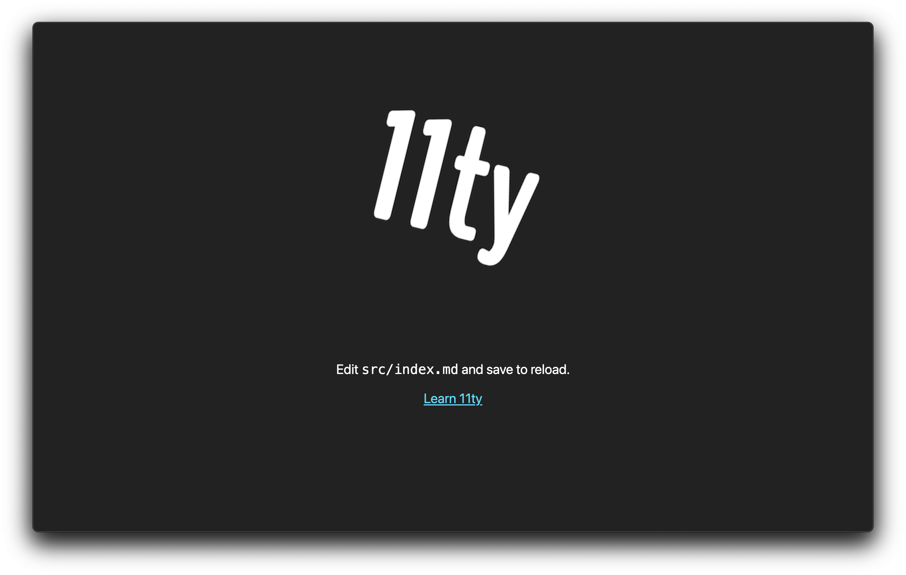

<h1 align="center">create-eleventy-app</h1>

<p align="center">
An unofficial (and unopinionated) CLI for creating Eleventy projects.
</p>

<figure align="center">
    
    <figcaption style="font-size: 0.8em">The homepage generated by <code>create-eleventy-app</code>. Originally created by <a href="https://github.com/bjankord/create-eleventy-site">Brett Jankord's <code>create-eleventy-site</code></a>.
    </figcaption>
</figure>

---

## Installation

```sh
npm install -g create-eleventy-app
```

## Usage

```sh
npx create-eleventy-app 
```

### Options

#### `--silent`

Silence the output of the CLI.

#### `--verbose`

Show verbose output of the CLI.
